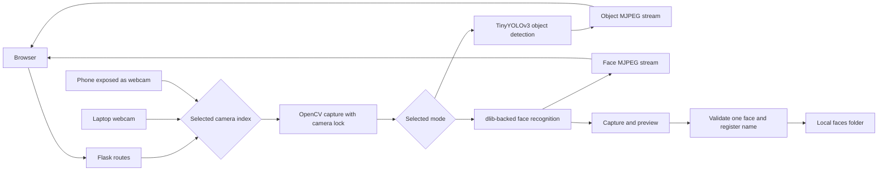

# Real-Time Vision Assistant

A local Flask application that streams camera video to a browser for **object detection** or **face recognition**. The two modes have separate MJPEG endpoints and share one selected camera. The face recognition page also supports capturing, previewing, and registering a new person.

This is a computer vision application built with pretrained models; it does not train a detector or a face recognition model. It runs on the local machine and is not deployed as a hosted service.

## Features

- Object detection using ImageAI's pretrained TinyYOLOv3 model.
- Face detection and encoding using `face_recognition` (backed by dlib), with known faces loaded from a local `faces/` folder.
- Separate browser streams for object detection and face recognition; a lock coordinates camera access when switching modes or capturing a photo.
- Camera selection in the browser: use the laptop's built-in webcam or a phone camera that the computer exposes as a webcam (for example, iPhone Continuity Camera). The operating system determines each camera's index.
- Face enrollment with capture, preview, name entry, and validation that exactly one face is visible. Capture reads eight frames and saves the last valid one.
- Face recognition processes frames at 25% of the original width and height and streams JPEG at quality 90.

## How it works



The camera is used by one mode at a time. Selecting a different mode releases the previous camera controller.

## Setup

Use Python 3.9 or 3.10 and a camera accessible to OpenCV. Installing `dlib` may require a C++ compiler and CMake. ImageAI also requires PyTorch and its image dependencies; follow the [ImageAI installation guide](https://github.com/OlafenwaMoses/ImageAI#installation) for your platform before installing this project's requirements.

```bash
python3 -m venv .venv
source .venv/bin/activate
python -m pip install -r requirements.txt
```

Download ImageAI's pretrained [TinyYOLOv3 `.pt` model](https://github.com/OlafenwaMoses/ImageAI/releases) and place it beside `App.py` as `tiny-yolov3.pt`. The model weights are intentionally excluded from this repository. Use the `.pt` model for ImageAI 3.x, not the older `.h5` model.

```bash
python App.py
```

Open `http://127.0.0.1:5000/camera_settings` and select the laptop webcam or a connected phone camera by its working camera index. The phone must appear as a camera device on the computer; opening this page on a phone does not use the phone's browser camera. Then choose object detection or face recognition. To register a person, open face recognition, capture a photo, review it, and save it with a name. Registered images remain in the local `faces/` directory. Captured photos remain in `static/captured_faces/` until removed.

On Windows, activate the environment with `.venv\Scripts\activate` instead of the `source` command above.

## Project files

| File | Purpose |
| --- | --- |
| `App.py` | Flask routes, stream generators, camera coordination, registration flow |
| `object_camera.py` | TinyYOLOv3 detection and JPEG frame generation |
| `facecam.py` | Face encoding, matching, capture, and registration |
| `templates/` | Browser pages |
| `static/style.css` | Page styling |
| `requirements.txt` | Direct Python dependencies |

Generated captures, known-face photos, cached files, and model weights are kept out of Git. Add your own consenting face images locally when testing.

## Scope and limitations

- This is a local prototype. It has no published accuracy, frame rate, or latency benchmark.
- Object detection speed depends on the camera, CPU/GPU, and pretrained model. Face recognition can make mistakes, especially with poor lighting or occlusion.
- The application uses Flask's development server and should not be exposed to the public internet without additional security and deployment work.
- Voice input and speech output are not implemented in this version.
